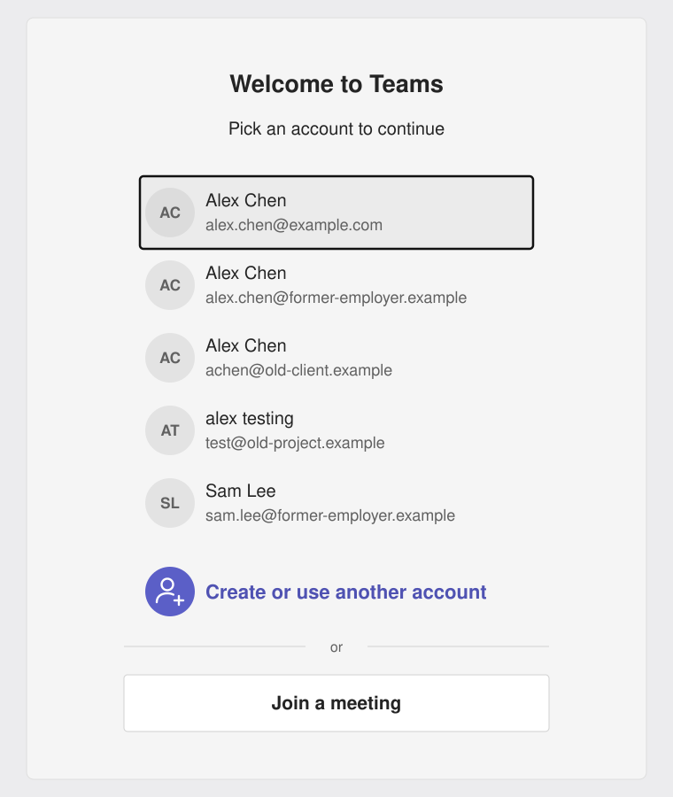

# Clean Microsoft Account for macOS

A small script that removes old Microsoft accounts from the "Pick an account" list in Microsoft Teams (and other Microsoft 365 apps) on a Mac.

## The problem

Teams on macOS keeps showing accounts you no longer use: former employers, test tenants, a colleague who once signed in on your Mac. They stay in the account picker for years, and the usual fixes do not remove them:



*Illustration only. The names and addresses are placeholders.*

- Deleting Teams and reinstalling it
- Clearing the Teams cache folders
- Deleting the `OneAuthAccount` entries from the login keychain

The accounts come back within seconds of opening Teams.

## Why the usual fixes fail

Microsoft apps store the account list in more than one place. The copy that matters lives in the macOS **local-items keychain** (the data protection keychain), under Microsoft's keychain access group:

```
UBF8T346G9.com.microsoft.identity.universalstorage
```

This store has three properties that make it hard to clean:

- It is not inside any app folder, so uninstalling an app leaves it untouched.
- The `security` command-line tool cannot list or delete items in it.
- When the other copies are deleted, Microsoft apps rebuild them from this one.

## What the script does

1. Lists the Microsoft accounts currently remembered and counts the items it will delete.
2. Asks you to type `yes` before changing anything.
3. Asks you to quit Outlook, Word, Excel, PowerPoint and OneNote if they are open, then closes Teams and OneDrive.
4. Backs up the local-items keychain folder to `~/keychain-backup-<date>-<time>`.
5. Deletes three sets of records:
   - Every item in the Microsoft access group above (local-items keychain)
   - Every `OneAuthAccount` item (login keychain)
   - Every `Microsoft Office Identities ...` item (login keychain)
6. Runs an integrity check on the keychain database and confirms nothing is left.

Nothing else in either keychain is touched.

## Usage

Download `clean-microsoft-accounts.command`, then make it executable once:

```bash
chmod +x clean-microsoft-accounts.command
```

Preview what would be removed, without changing anything:

```bash
./clean-microsoft-accounts.command --dry-run
```

Run it for real, either by double-clicking the file in Finder or from Terminal:

```bash
./clean-microsoft-accounts.command
```

Example preview output:

```
=== Clean Microsoft sign-in records ===

Accounts currently remembered:
  - you@example.com
  - old.account@former-employer.com

Will delete:
  Local-items keychain, Microsoft sign-in records: 61
  Login keychain, account copies: 2
  Login keychain, Office identity records: 2

(--dry-run: nothing was changed)
```

After it finishes, open Teams. The account picker should be empty, and you sign in again with only the account you want.

## What to expect afterwards

- Teams, OneDrive, Outlook, Word, Excel, PowerPoint and OneNote all need to sign in again.
- Your files, OneDrive content, Teams chats and app settings are not affected.
- Any account you sign back in to, in any Microsoft app, will appear in the Teams list again.

## Limitations

- **All or nothing.** Every Microsoft account is removed together. The item names in the keychain database are stored as hashes, so the script cannot tell which item belongs to which account.
- **Not supported by Apple.** The script deletes rows from the keychain database (`keychain-2.db`) with `sqlite3`, because no supported tool can reach these items. See the warning below.
- **May stop working.** If Microsoft or Apple change how these records are stored, the script will find nothing to clean. It only ever deletes items in the one Microsoft access group, so it will not remove unrelated items.

## Warning

This script edits the macOS keychain database directly. If that database is damaged, you could lose other locally saved passwords, such as Wi-Fi and app logins. The script takes a backup first and checks the database afterwards, but **use it at your own risk**.

If other apps misbehave after running it, restart the Mac first. The backup folder is a copy of `~/Library/Keychains/<UUID>/` taken before any change. Restoring from it has not been tested.

The backup contains an encrypted copy of your keychain. Delete it once you have confirmed everything works.

## Requirements

- macOS with `zsh`, `sqlite3` and `security` (all included with macOS)
- No administrator password and no extra software

## Tested on

- macOS 26.6.2 on Apple silicon
- Microsoft Teams 26246.1709.5146.8945

On this setup the cleanup steps were first run by hand and removed four stale accounts that had survived for about three years. The script automates those same steps.

## Safer alternatives to try first

- In Teams, go to **Settings > Accounts and orgs** and choose **Sign out** next to the account.
- In **Keychain Access**, select **Local Items**, quit all Microsoft apps, then search for and delete items whose names start with `accesstoken-`, `refreshtoken-` and `idtoken-`.

Use this script when those do not work.

## License

[MIT](LICENSE)
